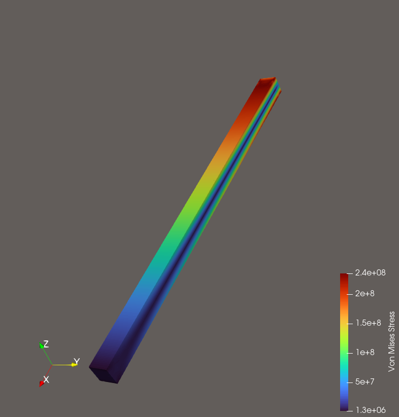

# FEMto
Finite element method simulation written completely from scratch in Odin.

> [!NOTE]
> FEMto is in early development.


## Overview
FEMto is a finite element solver designed to solve partial differential equations representing common physics. Currently, it focuses on
heat conduction and small-strain elasticity. With support for non-linear, time, and space dependant properties.

FEMto is designed to be small and simple, written in a plain procedural style without relying on third-party libraries.
A text-based configuration system wraps a subset of its functionality to allow rapid experimentation and iteration.

<p align="center">
  
  <p align="center"><i>Von Mises effective stress on a cantilever beam under end loading.</i></p>
</p>


> [!NOTE]
> The config interface is not intended to expose every feature of FEMto. To fully leverage its capabilities,
> users can implement custom materials, sources, boundary conditions or even new PDEs directly in code.


## Features
- 1D, 2D, 3D linear or curved geometries from [Gmsh](https://gmsh.info/).
- Visualization via [Paraview](https://www.paraview.org/).
- Steady-state / transient conduction, steady state elasticity.
- Text based config using a human-friendly JSON superset.
- Support for time, space, and solution dependent material models, source terms and boundary conditions.
- Non linear support via Newton *Picard-style supported through lagged values in the weak form.*
- 1st and 2nd order solution accuracy.

### Mesh Restrictions
- For 3D, hexes and tets only for now.
- Meshes should be well-behaved.
- Every entity including domain entities needs a physical name.
- **Version 2.2 Binary only**.

### Current Limitations
- Linear solver is limited. We currently rely on bi-conjugate gradient stabilized with no preconditioner.
- Dirichlet boundaries currently do not support time/space varying values yet.
- No way to read initial conditions in from a file from the config.
- Limited built-in sources and materials other than plain constant and linear ones.

## Validation
Nothing yet, mostly qualitative checks. Elasticity matches euler-bernoulli theory for cantilever beams.


## Quickstart

```sh
git clone https://github.com/Rwn-A/FEMto femto

cd femto

odin build src/app -o:speed -out:femto.exe

./femto.exe ./configs/conduction.mjson
```

## Architecture
The project is split into 3 distinct parts.
- **Core:** The base FEM and linear algebra code that supports the physics.
Other than `src/fe_core/layout.odin`, all of this code is method-agnostic CG, DG, HDG, etc. are all viable given the appropriate implementation.
- **Models:** The actual physics layer. Exposes an interface for implementing new weak forms, materials, boundaries and sources.
- **App:** Responsible for reading config and constructing a model. Not intended to expose every feature, for full control, implement directly against the Models interface.

## Configuration
Configuration is unstable while development is ongoing. At the time of writing the below example should be a good place to start.
```
name = "part_elastic" // used for the output name
mesh = "../meshes/cantilever_structured.msh" // mesh file
model = Elasticity // physics we are solving, other option for now is Conduction
sections = {
    beam = { // the name "beam" comes from a physical name applied to volume element(s) in your mesh
        material = {
            type = "constant",
            elastic_modulus = 2e11,
            poissons_ratio = 0.3,
            density = 7750 // kg/m^3
        }
        sources = [
            // empty in this case but for bending under its own weight we could do
            // {type = "constant", load = [0, 0, -77500] }
        ]
    }
}
fields = {
    displacement = {
        order = Quadratic, // use Linear or Quadratic
        boundaries = {
            // the names here come from names of boundary entities defined in your mesh
            "end_left" = [{type = "fixed", displacement=[0, 0, 0]}], // fix the displacement at 0, this is our cantilevers attachment point
            //apply a traction to the end face, we know the end face in this mesh has area 0.05 x 0.05, so this traction works out to 5kN
            "end_right" = [{type = "traction", traction = [0, 0, 2e6]}]
        }
    }
}

// this section can be omitted and left as default
// however, quadratic elements currently really stress the linear solver so relaxing tolerances is recommended for now.
linear_solver = {
    rtol = 1e-4
    max_iterations = 5000
}

// our problem is linear, but we messed with the linear solver tolerance so the non linear solver may think the problem was
// not truly solved. Eventually, this part of the config will be streamlined
non_linear_solver = {
    rtol = 1e-3
}

output = {
    directory = "../output",
    order = Quadratic, // what order to output at, reccomended to match your solution order
    frequency = 1, // only applies to transient simulations, default is 1 can be omitted
}
```

## Contributions
Welcome, especially if you're a wizard with multi-grid solvers.

## License
See LICENSE file.
