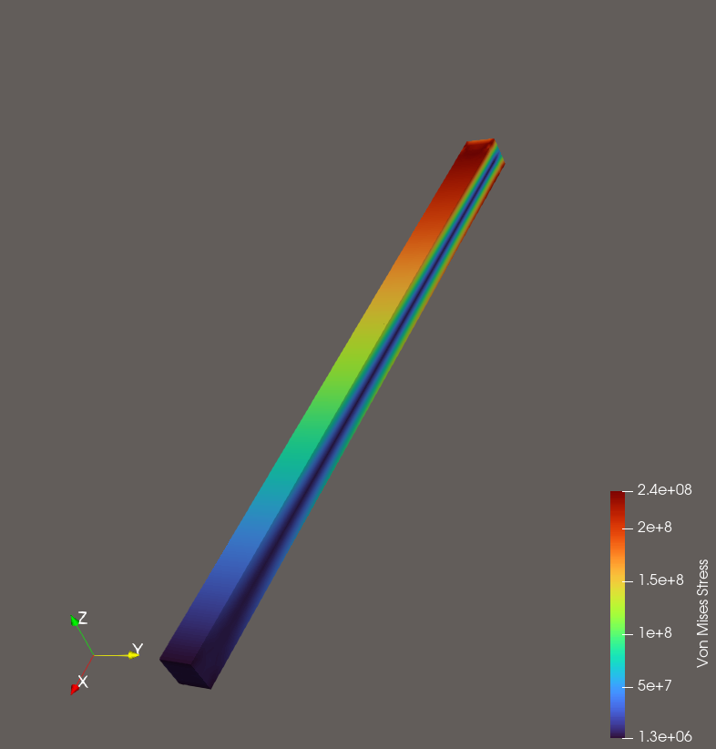

# FEMto

A finite element solver written in Odin.

> [!NOTE]
> FEMto is still in early development.

<p align="center">
  
  <p align="center"><i>Von Mises effective stress on a cantilever beam under end loading.</i></p>
</p>


## Overview

FEMto solves partial differential equations for common physics problems. Right now that means heat conduction, small-strain elasticity (3D).
Time-dependent problems are supported, along with nonlinear and spatially varying material models,
source terms and boundaries.

It’s written in a straightforward procedural style, with minimal dependencies.

Configuration is handled through a TOML-based system for quick setup and iteration. For anything beyond that, FEMto exposes a plugin system so
you can extend it with native code and wire it into configs.

> [!NOTE]
> Plugins are intentionally not all-powerful, if you want to do something deeply structural, you’ll still need to touch the source.


## Features
- 1D/2D/3D meshes via [Gmsh](https://gmsh.info/)
- Natively uses embedded meshes: 1D curves and 2D surfaces are always in 3D space
- Visualization via [ParaView](https://www.paraview.org/)
- Steady-state and transient solves
- TOML-based configuration system
- Native plugin system (shared libraries / DLLs)
- Time space and solution-dependent materials, sources, and boundary conditions
- Nonlinear heat conduction
- First and second order solution accuracy.
- Algebraic multigrid via [AMGCL](https://github.com/ddemidov/amgcl)
- Multithreaded assembly and solve

### Mesh Restrictions
- 3D supports tetrahedral and hexahedral meshes
- Meshes must be conforming
- Every entity (including domains) needs a physical name
- Not all models will work on all meshes due to element, dimensionality, or axis-aligned restrictions the config system
    will error if this is the case.
- Gmsh format 2.2 (binary only)


## Building
FEMto depends on [Odin](https://odin-lang.org/) and a C++ toolchain (for AMGCL).

First, build the AMGCL wrapper:

**Linux/macOS**
```sh
clang++ -std=c++17 -O2 -I./vendor -c src/foreign_wrappers/amgcl.cpp -o ./.build/amgcl_wrapper.o
llvm-ar rcs ./.build/amgcl.a ./.build/amgcl_wrapper.o
```

**Windows (clang)**
```sh
clang++ -std=c++17 -O2 -I./vendor -c src/foreign_wrappers/amgcl.cpp -o ./.build/amgcl_wrapper.obj
llvm-ar rcs ./.build/amgcl.lib ./.build/amgcl_wrapper.obj
```

> [!NOTE]
> MSVC users can use the equivalent `cl.exe` and `lib.exe` commands.

Then build FEMto (add `.exe` to the output name on Windows):
```sh
odin build src -out:./.build/femto -o:speed -microarch:native
```

And run an example:

```sh
./.build/femto ./examples/00_conduction.toml
```

To view results, use ParaView or load the output in Python with [PyVista](https://pyvista.org/).

## Configuration
Config reference is in progress, for now see the `examples` folder.

The most basic configuration is shown below:

```toml
model = "conduction"

mesh.path = "./meshes/2d_square.msh" # all paths are relative to the config file

[[materials.conduction]]
kind = "builtin:constant_material"
density = 7
conductivity = 10
specific_heat_capacity = 12

[[boundaries.conduction]]
kind = "builtin:isothermal"
boundaries = ["left"] # these are boundary names from the mesh we want to apply the boundary to.
temperature = 120
```


### Plugins
Plugins are still early, but can be used for extending models without recompiling FEMto itself.

Examples live in `examples/plugins`, and the built-in models work in a similar fashion under `src/models/*/builtin.odin`.

A plugin defines functions that take config data and return implementations used by a model.

## Architecture
FEMto is split into two layers:

- `src/fem`: core FEM primitives, designed to be used independently of `app` if needed.
- `src/*`: everything else is application code, physics models, config etc.


## Validation

Proper validation work is on going. Linear elasticity matches euler bernoulli for long slender beams and conduction results
seem reasonable for simple geometries.


## Performance

The two major costs in an FEM simulation are system assembly and sparse linear solving.

AMGCL handles linear solving and has been fast enough that optimizing its usage hasn't been a
priority. Though it's already orders of magnitude faster than the previous bespoke implementation.

System assembly is multithreaded, with basic element reordering to reduce contention, but hasn't been
optimized beyond that.

The codebase is simple and avoids expensive operations in hot loops, so baseline
performance is reasonably good. Planned work includes vectorizing element kernels across batches
of similar elements to amortize interface overhead and improve arithmetic throughput.

## Contributions
Always welcome.

## License
See LICENSE file.


